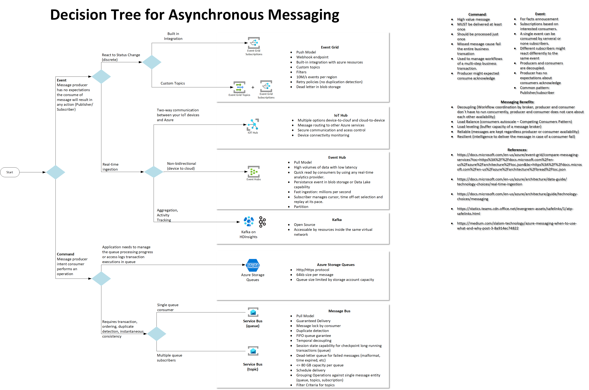
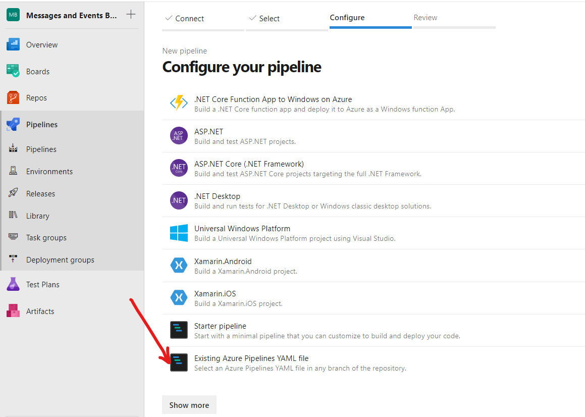
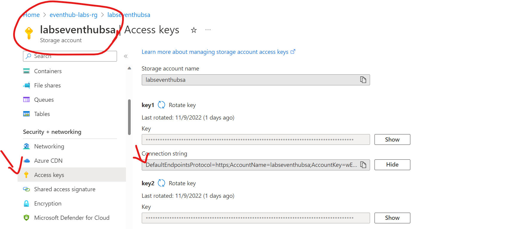
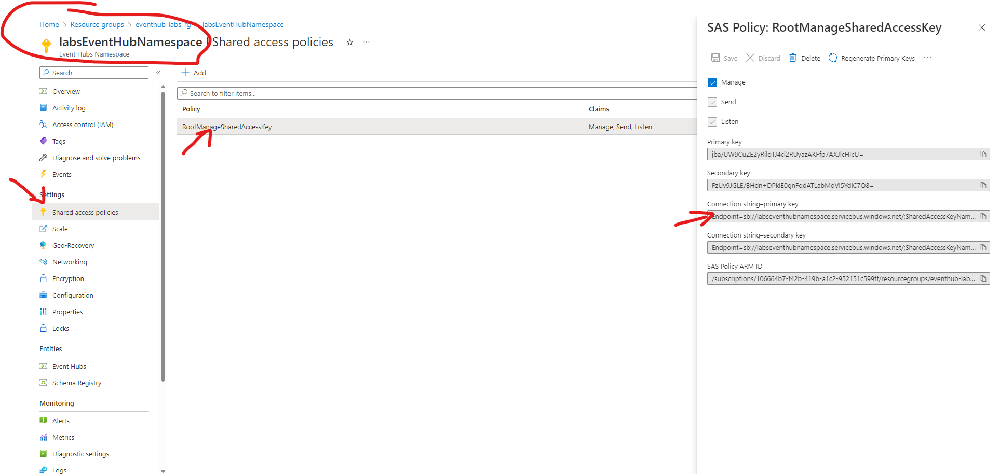
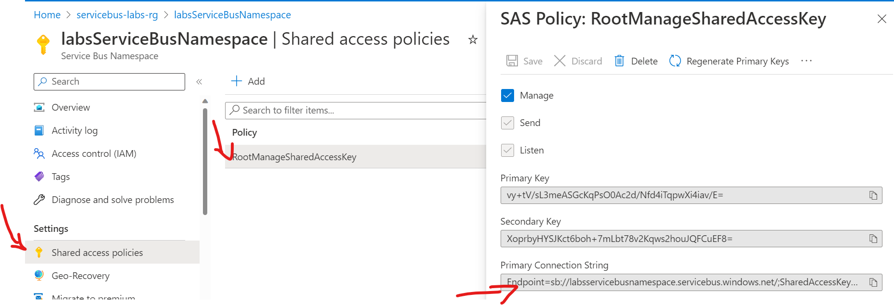
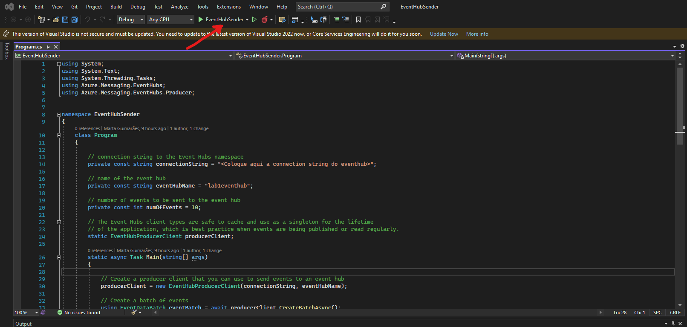
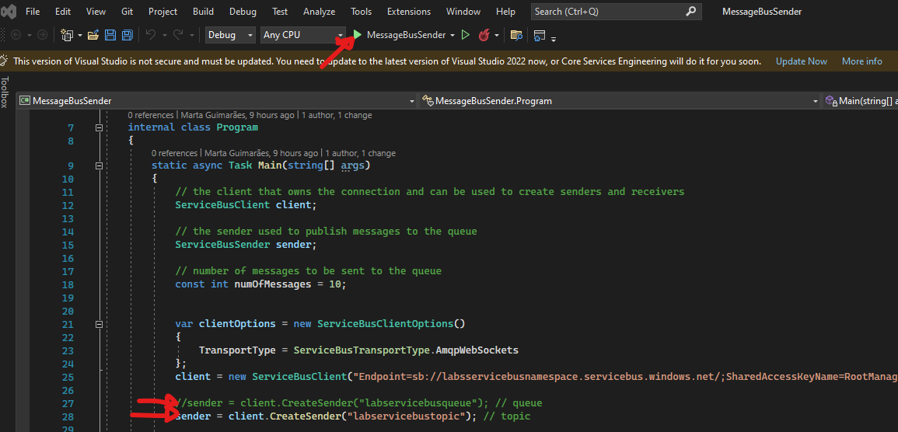

# Introduction 
This project aims to help you understand the difference between Azure message and event brokers usage. 
Refer to image below that provides you a guide to map your scenario and chose the most indicated broker to adopt in your solution. You can find visio file with the picture below inside repository. 

The project includes piece of code in .Net.
<b>IMPORTANT:</b> This is not aim to implement best practices, but helping you perform your tests and observe brokers behaviors and get knowledge about how they work. 

The current release provides piece of code for for Eventhub and Servicebus and you can use each one independently. The project is organized as following: 

>- Messages and Events Brokers
>>- EventHub
>>>- <b>EventHubSender</b>: Folder with Console app project files in VS 2022 just to send events to the Eventhub. For your information, It was created based on doc: https://learn.microsoft.com/en-us/azure/event-hubs/event-hubs-dotnet-standard-getstarted-send
>>>- <b>EventHubTriggerFunctions</b>: Folder with Eventhub trigger functions project files in vs code to receive events from Eventhub. There are 2 functions. Each one regards to a different consumer groups in eventhub. For your information, It was created based on doc:https://learn.microsoft.com/en-us/azure/azure-functions/functions-develop-vs-code?tabs=csharp. EventhubTrigger was used.
>>>- <b>Terraform</b>: Folder with Terraform files to create Eventhub infrastructure.
>>>- <b>azure-pipelines-EventHub-Terraform.yml</b>: Azure pipeline to create infrastructure for Eventhub.
>>>- <b>azure-pipelines-Eventhub-Functions.yml</b>: Azure pipeline deploy functions in the functionapp created to trigger since eventhub.
>>>- <b>azure-pipelines-EventHub-Terraform-Destroy.yml</b>: Azure pipeline to destroy eventhub infrastructure when you do not need it anylonger. 
>>- Servicebus
>>>- <b>MessageBusSender</b>: Folder with Console app project files in VS 2022 just to send messages to the Servicebus. For your information, It was created based on doc: https://learn.microsoft.com/en-us/azure/service-bus-messaging/service-bus-dotnet-get-started-with-queues?tabs=passwordless#launch-visual-studio-and-sign-in-to-azure
>>>- <b>MessageBusTriggerFunctions</b>: Folder with Servicebus trigger functions project files in vs code to receive messages from Servicebus. There are 3 functions. One is to receive messages from a queue. The other 2 are to receive messages from a topic where each one receives message to different subscribers. For your information, It was created based on doc:https://learn.microsoft.com/en-us/azure/azure-functions/functions-develop-vs-code?tabs=csharp. ServicebusTrigger was used. 
>>>- <b>Terraform</b>: Folder with Terraform files to create Servicebus infrastructure.
>>>- <b>azure-pipelines-ServiceBus-Terraform.yml</b>: Azure pipeline to create infrastructure for Servicebus.
>>>- <b>azure-pipelines-ServiceBus-Functions.yml</b>: Azure pipeline deploy functions in the functionapp created to trigger since servicebus.
>>>- <b>azure-pipelines-ServiceBus-Terraform-Destroy.yml</b>: Azure pipeline to destroy servicebus infrastructure when you do not need it anylonger. 

# Getting Started
1. Pre-Requirements
- Azure Subscription
- Azure Devops
- vs code
- vs 2022

2.	Installation process

2.1 <b>Azure</b>
- <b>Storage Account:</b> Create a storage account named as <b>dowdtf</b>. It´s refered by Terraform azure pipelines.
     - <b>Container:</b> Create a container named <b>tfstateeventhub-labs-resources</b>. It will be used by Terraform to store terraform.tfstate regarding to evethub infrastructure.
     - <b>Container:</b> Create a container named <b>tfstateservicebus-labs-resources</b>. It will be used by Terraform to store terraform.tfstate regarding to servicebus infrastructure.

2.2 <b>Azure Devops</b>
- <b>Project service connection:</b>Create a project using azure devops and configure a service connection named <b>sc-dowdtf</b>. Such service connection shall have authorization to access resources created according item 1.1 and also to create resource groups. As a reference guide to create service connections: https://learn.microsoft.com/en-us/azure/devops/pipelines/library/service-endpoints?view=azure-devops&tabs=yaml.

- <b>Terraform Azure Pipelines:</b> The current release does not trigger the pipelines automatically so you must run manually. To create infrastructure for Eventhub and Servicebus you must execute the correspondent terraform pipeline using azure devops pipelines. To run azure pipelines, create since an existing Azure Pipeline YAML file like this: 
    

3.	Software dependencies

3.1 <b>VS 2022 Project inside EventHubSender folder:</b> Open the visual studio project and install the nuget packages according to https://learn.microsoft.com/en-us/azure/event-hubs/event-hubs-dotnet-standard-getstarted-send#add-the-event-hubs-nuget-package

3.2 <b>VS 2022 Project inside MessageBusSender folder:</b> Open the visual studio project and install the nuget packages according to https://learn.microsoft.com/en-us/azure/service-bus-messaging/service-bus-dotnet-get-started-with-queues?tabs=passwordless#add-the-nuget-packages-to-the-project

# Build and Test
1.	Build

1.1 Azure Devops build and deploy functions. For each functions azure pipeline, adjust appSettings in AzureAppServiceSettings@1 task:

- <b>azure-pipelines-Eventhub-Functions.yml:</b> Edit this file and change the following in the mentioned task:
     - <b>AzureWebJobsStorage:</b> The value must be the storage account connection string created inside eventhub-labs-rg resource group
                  

     - <b>labsEventHubNamespace_RootManageSharedAccessKey_EVENTHUB:</b> The value must be the SAS created inside eventhub-labs-rg resource group. CAUSION: Keep the suffix ;EntityPath=lab1eventhub"
                  

- <b>azure-pipelines-ServiceBus-Functions.yml:</b> Edit this file and change the following in the mentioned task:
     - <b>AzureWebJobsStorage:</b> The value must be the storage account connection string created inside servicebus-labs-rg resource group
         ![Image alt text](./ReadmeImages/servicebusStorageAccountConnString.png         

     - <b>labsEventHubNamespace_RootManageSharedAccessKey_EVENTHUB:</b> The value must be th eservicebus SAS created inside servicebus-labs-rg resource group."
                  

1.2	Sender projects in VS 2022

- <b>Eventhub</b>
     - <b>VS 2022 Project inside EventHubSender folder:</b> Inside Program.cs, find "Coloque aqui a connection string do eventhub" and replace it by the eventhub SAS created inside eventhub resource group
                  

- <b>Servicebus</b>
     - <b>VS 2022 Project inside MessageBusSender folder:</b>Inside Program.cs, find "Coloque aqui a connection string do servicebus" and replace it by the servicebus SAS created inside eventhub resource group
                  

1.3	Functions projects in VS Code

- <b>settings.json from both eventhub and servicebus projects</b>
     - <b>azureFunctions.projectRuntime:</b> Inside .vscode folder in each project, the azureFunctions.projectRuntime must be set to "~4"

2.	Test

2.1 Eventhub

- <b>VS 2022 Project inside EventHubSender folder:</b>Open the visual studio project and run the project: 
                         

- <b>VS 2022 Project inside MessageBusSender folder:</b>Open the visual studio project and run the project. Note that first of all, you need to chose if you want to test message or topic, so you need to comment and/or uncomment according your chosen, then run the project: 
                         

# Contribute
There are other brokers to be explored and architectures that combine more than one usage to work in coordination. Feel free to add piece of code that implements them. 
Authentication and authorization can be improved. Currently SAS is being used to connect functions in the eventhub and servicebus. 
